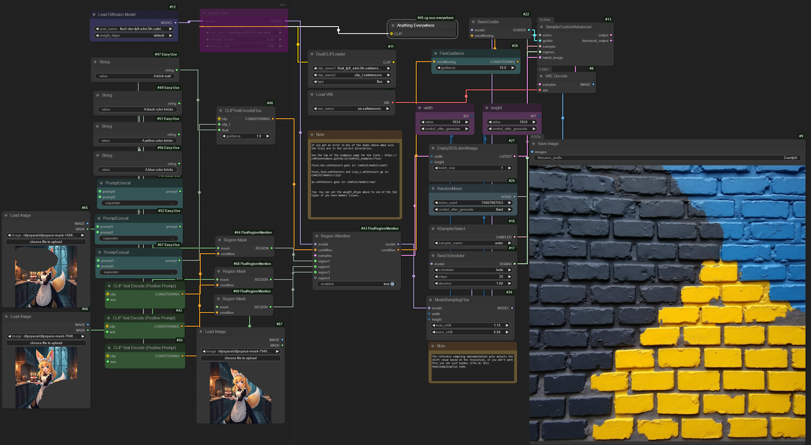
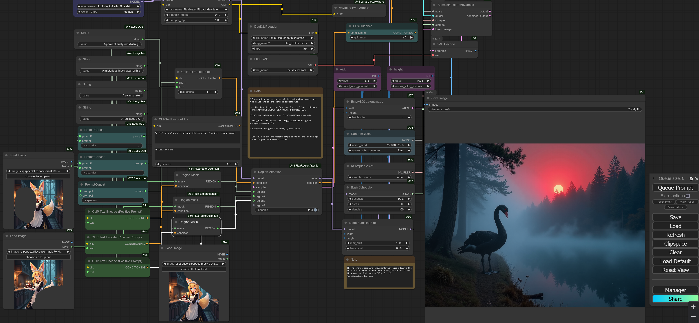

# ComfyUI-FluxRegionAttention

Implement Region Attention for Flux model. Add node RegionAttention that takes a regions - mask + condition, mask could be set from comfyui masks or bbox in FluxRegionBBOX node. This code is not optimized and has a memory leak. If you caught a OOM just try run a query againg - works on my RTX3080.

For generation it uses a usual prompt that have influence to all picture and a regions that have their own prompts. Base prompt good for setup background and style of image.

This is train-free technique and results not always stable - sometimes need to try several seeds or change prompt.

## Examples

Workflows in the metadata

## Nodes screenshot

1. Region attention influence only to t5_xxl embeddings, for clip_l embeddings we can use concatinated prompt (stronger regional conditioning) or only common prompg (weaker conditioning).

2. Pipeline

## Aknowledgements

This repository is base on next repositories:

@Misc{omost,
  author = {Omost Team},
  title  = {Omost GitHub Page},
  year   = {2024},
}

[Gligen-GUI](https://github.com/mut-ex/gligen-gui)

[black-forest-labs](https://github.com/black-forest-labs/flux)

[lucidrains attention implementation](https://github.com/lucidrains/memory-efficient-attention-pytorch)